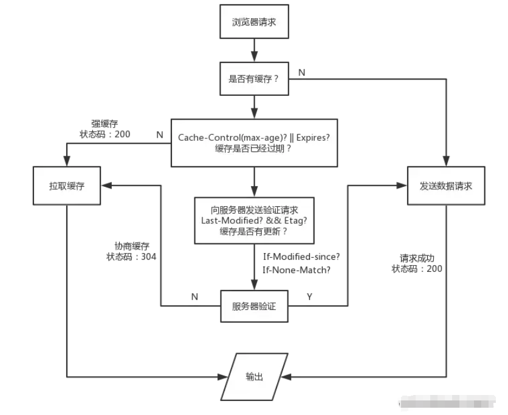
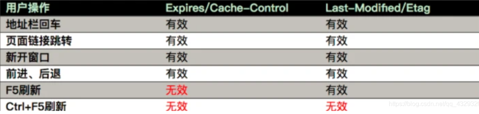

# 浏览器缓存机制

浏览器缓存是浏览器在本地磁盘对用户最近请求过的文档进行存储，当访问者再次访问同一页面时，浏览器就可以直接从本地磁盘加载文档。 

浏览器缓存主要分为`强缓存`（也称本地缓存）和`协商缓存`（也称弱缓存）。

用户发起了一个http请求后：

## 强缓存

浏览器发现本地已有所请求资源的缓存，便开始检查缓存资源之前被请求时返回的`响应头`信息是否有 `Cache-Control` 或 `Expires` 字段，如果有则代表该资源是强缓存

### Cache-Control

该字段常用值有：

- **max-age**：缓存的有效时长，单位为秒。比如`Cache-Control:max-age=31536000`。第一次访问资源时会通过响应头的`Date`加上`max-age`来计算出过期时间点，从而在后续二次请求时与当前系统时间比较判断是否过期。
- **no-cache**：含义是不使用强缓存，需要使用协商缓存，也就是先与服务器确认缓存是否可用。
- **no-store**：禁用缓存，每次都从服务器获取最新的资源。
- public：资源客户端和服务器都可以缓存。
- private：资源只有客户端可以缓存。

### Expires

是HTTP1.0控制网页缓存的字段，值为一个本地时间戳字符串，如`Wed, 21 Oct 2023 07:28:00 GMT`，代表该资源缓存的`到期时间`。

:::warning Expires的缺点

- Expires提供的是具体过期时间点，如果服务器的时间和客户端的时间有偏差，就可能导致问题。
- 很容易在配置后忘记具体的过期时间，而使用Cache-Control的max-age的相对时间会更加`灵活好记`

在HTTP 1.1 中`Expires`已经逐渐被 `Cache-Control` 取代。

:::

这两个字段都可用来判断缓存是否过期，当同时存在时，则以`Cache-Control`为准。

如果缓存未过期，则该请求会自动返回`200`状态码并使用缓存，此时就完成了一次强缓存的过程。

如果符合以下任一条件：
- 缓存过期（比如`Cache-Control:max-age=0`）
- `Cache-Control`值为`no-cache`
- 缓存资源的响应头信息并没有包含`Cache-Control` 或 `Expires` 字段

则进入`协商缓存`过程的判断（`即两种缓存的相关响应头字段同时存在时，强缓存优先级更高`）。

## 协商缓存

如果没有执行强缓存过程，则需要判断协商缓存：

此时浏览器会判断缓存资源的`响应头`信息中是否有`ETag`或`Last-Modified`字段：

- 如果没有，则发起一个http请求，服务器根据请求返回最新资源

- 如果有，则在请求头中添加`If-None-Match`字段（有`ETag`字段的话添加）、`If-Modified-Since`字段（有`Last-Modified`字段的话添加）。

### Last-Modified

文件在服务器`最后被修改的本地时间字符串`，比如Last-Modified:Mon, 27 May 2024 07:57:42 GMT。资源更新时，服务器端的Last-Modified值也随之更新。

若缓存资源的响应头信息中有`Last-Modified`字段，则在后续重新请求该资源时请求头中添加`If-Modified-Since`字段，它的值就是之前缓存资源的响应头信息的ETag的值。

接着服务器会比对**服务器端最新的Last-Modified**与**请求头If-Modified-Since**的值是否一致：

- 如果不一致，服务器则接受请求，返回状态码200以及最新的资源；

- 如果一致，表明资源未更新，则返回状态码为`304 Not Modified`的响应，可继续使用本地缓存，即完成了一次协商缓存。

### ETag

当前资源文件的一个唯一标识(由服务器生成)，比如Etag:"66543cf6-37c"，`资源内容有修改时（跟之前版本比较）`时，服务器端的ETag值也随之更新。

若缓存资源的响应头信息中有`ETag`字段，则在后续重新请求该资源时请求头中添加`If-None-Match`字段，它的值就是之前缓存资源的响应头信息的ETag的值。

接着服务器会比对**服务器端最新的ETag**与**请求头If-None-Match**的值是否一致：

- 如果不一致，服务器则接受请求，返回状态码200以及最新的资源；

- 如果一致，表明资源内容没有变化，则返回状态码为`304 Not Modified`的响应，可继续使用本地缓存，即完成了一次协商缓存。

### ETag vs Last-Modified

`Etag 优先级高于 Last-Modified`，若 Etag 与 Last-Modified 两者同时存在，服务器优先校验 Etag

HTTP1.1中ETag的出现主要是为了解决几个Last-Modified比较难解决的问题：

- 一些文件也许会周期性的更改，但是内容并不改变(仅仅改变的修改时间)，这时候并不希望客户端认为这个文件被修改了而重新去请求；

- 某些文件修改非常频繁，比如在秒以下的时间内进行修改，(比方说 1s 内修改了 N 次)，If-Modified-Since 能检查到的粒度是`秒级`的，使用 Etag 就能够保证这种需求下客户端在 1 秒内能刷新 N 次 cache

## 用户行为的影响

一些用户的主动行为是否会使浏览器缓存失效：

