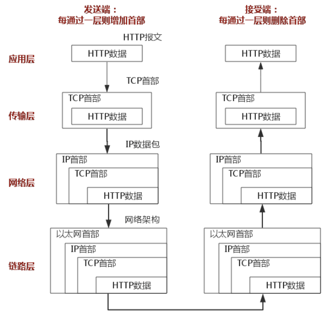

# HTTP协议

## TCP/IP 协议族

`TCP/IP 协议族`是Internet最基本的协议，HTTP协议是它的一个`子集`。TCP/IP协议族按层次分为以下四层

- **应用层**

    负责处理网络应用程序之间的通信，如`FTP`协议（文件传输)，`HTTP`协议（Web通信），`DNS`协议（域名系统）。

- **传输层**

   提供处于网络连接中两台计算机之间的数据传输所使用的协议，如`UDP`协议（面向无连接，高效轻便），`TCP`协议（全双工通信，稳定可靠）。
   >TCP协议通信：[三次握手] & [四次挥手]

- **网络层**

   规定了数据通过怎样的传输路线到达对方计算机传送给对方，如`IP`协议。

- **链路层**

   用来处理连接网络的硬件部分（如网卡，光纤等）。

WEB应用的通信传输的一般流程：

## HTTP

[三次握手]:/principle/browser-render#网络请求
[四次挥手]:/principle/browser-render#断开连接
